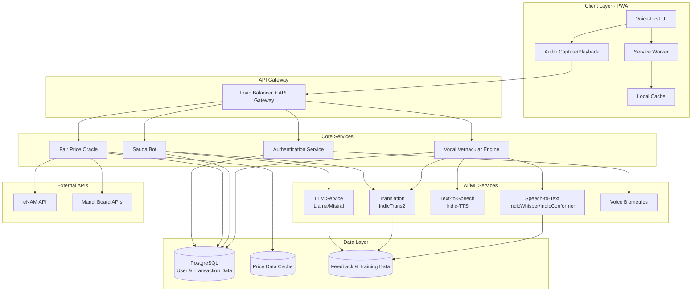

# Design Document: Multilingual Mandi

## Overview

Multilingual Mandi is a voice-first Progressive Web Application (PWA) that enables seamless real-time communication and trade between farmers and traders across India's linguistic diversity. The platform consists of three core subsystems:

1. **Vocal Vernacular Engine**: Real-time voice-to-voice translation supporting all 22 scheduled Indian languages
2. **Fair Price Oracle**: Market intelligence system providing real-time commodity pricing from government and crowd-sourced data
3. **Sauda Bot**: AI-powered negotiation assistant with cultural context awareness

The design prioritizes low-bandwidth operation (2G/3G), offline-first architecture, and voice-centric interaction for users with low text literacy.

## Architecture

### High-Level Architecture



### Technology Stack

**Frontend**:
- Framework: React with TypeScript (chosen for ecosystem maturity and PWA support)
- State Management: Zustand (lightweight, ~1KB)
- Audio: Web Audio API + MediaRecorder API
- PWA: Workbox for service worker management
- Build: Vite (fast builds, optimized for production)

**Backend**:
- Framework: Python with FastAPI (async support, excellent for ML integration)
- API Gateway: Nginx with load balancing
- WebSocket: For real-time audio streaming
- Task Queue: Celery with Redis (for async ML processing)

**AI/ML Stack**:
- STT: AI4Bharat IndicWhisper (fine-tuned for Indian languages)
- Translation: AI4Bharat IndicTrans2 (supports all 22 languages)
- TTS: AI4Bharat Indic-TTS or Bhashini TTS
- LLM: Llama 3.1 8B (quantized for efficiency) or Mistral 7B
- Voice Biometrics: SpeechBrain or PyAnnote

**Data Layer**:
- Primary DB: PostgreSQL 15+ (ACID compliance, JSON support)
- Cache: Redis (price data, session management)
- Object Storage: MinIO (for temporary audio files if needed)

**Infrastructure**:
- Containerization: Docker + Docker Compose
- Orchestration: Kubernetes (for production scaling)
- Monitoring: Prometheus + Grafana
- Logging: ELK Stack (Elasticsearch, Logstash, Kibana)

### External API Integration Strategy

**eNAM API Considerations**:
- eNAM API access may require official registration or partnership with government
- Documentation and public API availability may be limited
- **Mitigation Strategy**:
  1. Pursue official partnership/registration for eNAM API access
  2. Implement robust fallback to state mandi board APIs
  3. Use crowd-sourced price data from platform users
  4. Provide realistic demo/synthetic data for development and as last resort
  5. Clearly indicate data source to users (official vs. crowd-sourced vs. demo)

**Data Source Priority**:
1. eNAM API (if available)
2. State Mandi Board APIs
3. Crowd-sourced user data
4. Demo data (for development and fallback)

**Demo Data Strategy**:
- Realistic price data based on typical Indian agricultural markets
- Seasonal price variations (e.g., tomatoes cheaper in summer)
- Regional price differences (e.g., Maharashtra vs. Tamil Nadu)
- Random variation (±10%) to simulate market dynamics
- Clearly marked as "demo" or "estimated" data in UI

## Components and Interfaces

### 1. Vocal Vernacular Engine

**Purpose**: Orchestrates the complete voice-to-voice translation pipeline.

**Components**:

#### 1.1 Audio Capture Module
```python
class AudioCaptureModule:
    """Handles audio input from user's device"""
    
    def capture_audio(self, duration_ms: int) -> AudioBuffer:
        """
        Captures audio from microphone
        Returns: Raw audio buffer in PCM format
        """
        pass
    
    def detect_speech_activity(self, audio: AudioBuffer) -> bool:
        """
        Uses Voice Activity Detection (VAD) to detect speech
        Returns: True if speech is detected
        """
        pass
    
    def apply_noise_reduction(self, audio: AudioBuffer) -> AudioBuffer:
        """
        Applies noise reduction using spectral subtraction
        Targets 70+ dB noise environments
        """
        pass
```

#### 1.2 Language Detection Service
```python
class LanguageDetector:
    """Detects language and dialect from audio"""
    
    def detect_language(self, audio: AudioBuffer) -> LanguageResult:
        """
        Detects primary language from audio
        Returns: Language code (ISO 639-3) and confidence score
        Uses: Whisper's built-in language detection or separate classifier
        """
        pass
    
    def detect_code_switching(self, audio: AudioBuffer) -> List[LanguageSegment]:
        """
        Detects multiple languages in single utterance
        Returns: List of (language, start_time, end_time) tuples
        """
        pass
```

#### 1.3 Speech-to-Text Service
```python
class STTService:
    """Transcribes speech to text using IndicWhisper"""
    
    def __init__(self):
        self.model = load_model("ai4bharat/indic-whisper-medium")
        self.dialect_adapters = {}  # Fine-tuned adapters for dialects
    
    def transcribe(
        self, 
        audio: AudioBuffer, 
        language: str,
        dialect: Optional[str] = None
    ) -> TranscriptionResult:
        """
        Transcribes audio to text
        Returns: Text, confidence score, word-level timestamps
        """
        pass
    
    def transcribe_with_correction(
        self,
        audio: AudioBuffer,
        language: str,
        domain_vocabulary: List[str]
    ) -> TranscriptionResult:
        """
        Transcribes with domain-specific vocabulary boosting
        Handles commodity names, units, prices
        """
        pass
```

#### 1.4 Translation Service
```python
class TranslationService:
    """Translates text between Indian languages using IndicTrans2"""
    
    def __init__(self):
        self.model = load_model("ai4bharat/indictrans2-indic-indic-1B")
        self.tokenizer = load_tokenizer("ai4bharat/indictrans2-indic-indic-1B")
    
    def translate(
        self,
        text: str,
        source_lang: str,
        target_lang: str
    ) -> TranslationResult:
        """
        Translates text between languages
        Returns: Translated text and confidence score
        """
        pass
    
    def translate_with_context(
        self,
        text: str,
        source_lang: str,
        target_lang: str,
        conversation_history: List[Message]
    ) -> TranslationResult:
        """
        Translates with conversation context for better accuracy
        Handles pronouns and references
        """
        pass
    
    def preserve_entities(
        self,
        text: str,
        entities: List[Entity]
    ) -> str:
        """
        Ensures commodity names, prices, units are preserved
        """
        pass
```

#### 1.5 Text-to-Speech Service
```python
class TTSService:
    """Converts text to speech using Indic-TTS"""
    
    def __init__(self):
        self.models = {}  # One model per language
        self.load_language_models()
    
    def synthesize(
        self,
        text: str,
        language: str,
        speech_rate: float = 0.85  # 15% slower for clarity
    ) -> AudioBuffer:
        """
        Converts text to speech
        Returns: Audio buffer in MP3 format (compressed)
        """
        pass
    
    def adjust_for_environment(
        self,
        audio: AudioBuffer,
        noise_level: float
    ) -> AudioBuffer:
        """
        Adjusts volume based on ambient noise
        """
        pass
```

#### 1.6 VVE Orchestrator
```python
class VocalVernacularEngine:
    """Main orchestrator for voice-to-voice translation"""
    
    def __init__(self):
        self.audio_capture = AudioCaptureModule()
        self.lang_detector = LanguageDetector()
        self.stt = STTService()
        self.translator = TranslationService()
        self.tts = TTSService()
    
    async def process_voice_message(
        self,
        audio: AudioBuffer,
        target_language: str,
        conversation_context: ConversationContext
    ) -> VoiceResponse:
        """
        Complete pipeline: Audio → Text → Translation → Speech
        Target latency: < 8 seconds end-to-end
        """
        # 1. Detect language (< 2s)
        source_lang = await self.lang_detector.detect_language(audio)
        
        # 2. Transcribe (< 3s)
        transcription = await self.stt.transcribe(audio, source_lang)
        
        # 3. Translate (< 2s)
        translation = await self.translator.translate(
            transcription.text,
            source_lang,
            target_language
        )
        
        # 4. Synthesize speech (< 2s)
        output_audio = await self.tts.synthesize(
            translation.text,
            target_language
        )
        
        return VoiceResponse(
            audio=output_audio,
            transcription=transcription.text,
            translation=translation.text,
            latency_ms=self.calculate_latency()
        )
```

### 2. Fair Price Oracle

**Purpose**: Provides real-time market intelligence for commodity pricing.

**Components**:

#### 2.1 Price Data Aggregator
```python
class PriceDataAggregator:
    """Aggregates price data from multiple sources"""
    
    def __init__(self):
        self.enam_client = ENAMAPIClient()  # May require registration/partnership
        self.mandi_clients = {}  # State-specific mandi board clients
        self.crowd_source_db = CrowdSourcePriceDB()
        self.demo_data_provider = DemoDataProvider()  # For development and fallback
    
    async def fetch_enam_prices(
        self,
        commodity: str,
        state: Optional[str] = None
    ) -> List[PriceData]:
        """
        Fetches prices from eNAM API
        Note: eNAM API access may require registration or official partnership
        Falls back to demo data if API is unavailable
        Returns: List of prices from different mandis
        """
        try:
            return await self.enam_client.get_prices(commodity, state)
        except (APIAccessError, RegistrationRequiredError):
            logger.warning("eNAM API unavailable, using fallback data")
            return await self.get_fallback_prices(commodity, state)
    
    async def get_fallback_prices(
        self,
        commodity: str,
        state: Optional[str] = None
    ) -> List[PriceData]:
        """
        Fallback price data strategy:
        1. Try state mandi board APIs
        2. Try crowd-sourced data
        3. Use demo/synthetic data as last resort
        """
        # Try state mandi boards
        if state and state in self.mandi_clients:
            try:
                return await self.mandi_clients[state].get_prices(commodity)
            except Exception:
                pass
        
        # Try crowd-sourced data
        crowd_prices = await self.crowd_source_db.get_prices(commodity, state)
        if crowd_prices:
            return crowd_prices
        
        # Last resort: demo data
        return await self.demo_data_provider.get_demo_prices(commodity, state)
    
    async def fetch_mandi_prices(
        self,
        commodity: str,
        state: str
    ) -> List[PriceData]:
        """
        Fetches from state mandi board APIs
        """
        pass
    
    async def get_crowd_sourced_prices(
        self,
        commodity: str,
        location: Location,
        radius_km: int = 50
    ) -> List[PriceData]:
        """
        Gets prices reported by nearby users
        """
        pass
    
    async def aggregate_prices(
        self,
        commodity: str,
        location: Location
    ) -> PriceAggregation:
        """
        Combines all sources and calculates statistics
        Returns: min, max, average, median, std_dev
        """
        pass
```

#### 2.4 Demo Data Provider
```python
class DemoDataProvider:
    """Provides realistic demo data for development and fallback"""
    
    def __init__(self):
        self.demo_data = self.load_demo_data()
        self.price_variation = 0.1  # 10% random variation
    
    def load_demo_data(self) -> Dict[str, CommodityPriceData]:
        """
        Loads demo price data for common commodities
        Based on typical Indian agricultural market prices
        """
        return {
            "tomato": CommodityPriceData(
                base_price=20.0,  # Rs per kg
                seasonal_factor=self.get_seasonal_factor("tomato"),
                regional_variations={
                    "Maharashtra": 1.0,
                    "Karnataka": 0.95,
                    "Tamil Nadu": 1.05,
                    "Andhra Pradesh": 0.98
                }
            ),
            "onion": CommodityPriceData(
                base_price=25.0,
                seasonal_factor=self.get_seasonal_factor("onion"),
                regional_variations={
                    "Maharashtra": 1.0,
                    "Karnataka": 0.92,
                    "Tamil Nadu": 1.08,
                    "Andhra Pradesh": 0.96
                }
            ),
            "potato": CommodityPriceData(
                base_price=18.0,
                seasonal_factor=self.get_seasonal_factor("potato"),
                regional_variations={
                    "Maharashtra": 1.0,
                    "Karnataka": 0.97,
                    "Tamil Nadu": 1.03,
                    "Andhra Pradesh": 0.99
                }
            ),
            "rice": CommodityPriceData(
                base_price=35.0,
                seasonal_factor=self.get_seasonal_factor("rice"),
                regional_variations={
                    "Maharashtra": 1.0,
                    "Karnataka": 0.94,
                    "Tamil Nadu": 1.02,
                    "Andhra Pradesh": 0.96
                }
            ),
            "wheat": CommodityPriceData(
                base_price=28.0,
                seasonal_factor=self.get_seasonal_factor("wheat"),
                regional_variations={
                    "Maharashtra": 1.0,
                    "Karnataka": 0.98,
                    "Tamil Nadu": 1.04,
                    "Andhra Pradesh": 0.97
                }
            ),
            # Add more commodities...
        }
    
    def get_seasonal_factor(self, commodity: str) -> float:
        """
        Returns seasonal price adjustment factor based on current month
        Simulates seasonal price variations
        """
        month = datetime.now().month
        seasonal_patterns = {
            "tomato": {1: 1.2, 2: 1.1, 3: 0.9, 4: 0.8, 5: 0.85, 6: 0.9,
                      7: 1.0, 8: 1.1, 9: 1.15, 10: 1.2, 11: 1.1, 12: 1.15},
            "onion": {1: 0.9, 2: 0.85, 3: 0.9, 4: 1.0, 5: 1.1, 6: 1.2,
                     7: 1.3, 8: 1.2, 9: 1.1, 10: 1.0, 11: 0.95, 12: 0.9},
            # Add patterns for other commodities...
        }
        return seasonal_patterns.get(commodity, {}).get(month, 1.0)
    
    async def get_demo_prices(
        self,
        commodity: str,
        state: Optional[str] = None
    ) -> List[PriceData]:
        """
        Generates realistic demo price data with variation
        Returns: List of prices from simulated mandis
        """
        if commodity not in self.demo_data:
            # Return generic price for unknown commodities
            return self.generate_generic_price(commodity, state)
        
        commodity_data = self.demo_data[commodity]
        base_price = commodity_data.base_price
        seasonal_factor = commodity_data.seasonal_factor
        regional_factor = commodity_data.regional_variations.get(state, 1.0)
        
        # Generate prices for multiple simulated mandis
        prices = []
        for i in range(3):  # Simulate 3 mandis
            # Add random variation (±10%)
            variation = random.uniform(1 - self.price_variation, 1 + self.price_variation)
            price = base_price * seasonal_factor * regional_factor * variation
            
            prices.append(PriceData(
                commodity=commodity,
                price=round(price, 2),
                unit="kg",
                source=PriceSource.DEMO,
                location=Location(state=state or "Maharashtra", district=f"Demo District {i+1}"),
                mandi_name=f"Demo Mandi {i+1}",
                timestamp=datetime.now()
            ))
        
        return prices
    
    def generate_generic_price(
        self,
        commodity: str,
        state: Optional[str] = None
    ) -> List[PriceData]:
        """
        Generates generic price for unknown commodities
        Uses a base price of 20 Rs/kg with variation
        """
        base_price = 20.0
        prices = []
        for i in range(3):
            variation = random.uniform(0.8, 1.2)
            prices.append(PriceData(
                commodity=commodity,
                price=round(base_price * variation, 2),
                unit="kg",
                source=PriceSource.DEMO,
                location=Location(state=state or "Maharashtra", district=f"Demo District {i+1}"),
                mandi_name=f"Demo Mandi {i+1}",
                timestamp=datetime.now()
            ))
        return prices
```

#### 2.2 Price Comparison Engine
```python
class PriceComparisonEngine:
    """Compares quoted prices against market data"""
    
    def analyze_quote(
        self,
        commodity: str,
        quoted_price: float,
        market_data: PriceAggregation
    ) -> PriceAnalysis:
        """
        Analyzes if quote is fair, high, or low
        Returns: Analysis with recommendation
        """
        avg = market_data.average
        std = market_data.std_dev
        
        if abs(quoted_price - avg) <= 0.05 * avg:
            return PriceAnalysis(
                verdict="fair",
                message=f"Price is fair. Market average is {avg}"
            )
        elif quoted_price > avg + 0.10 * avg:
            return PriceAnalysis(
                verdict="high",
                message=f"Price is {((quoted_price - avg) / avg * 100):.1f}% above market average of {avg}"
            )
        else:
            return PriceAnalysis(
                verdict="low",
                message=f"Price is {((avg - quoted_price) / avg * 100):.1f}% below market average of {avg}"
            )
```

#### 2.3 Price Cache Manager
```python
class PriceCacheManager:
    """Manages caching of price data for offline access"""
    
    def __init__(self):
        self.redis_client = Redis()
        self.cache_ttl = 3600  # 1 hour
    
    def cache_price_data(
        self,
        commodity: str,
        location: Location,
        data: PriceAggregation
    ):
        """Caches price data with TTL"""
        pass
    
    def get_cached_price(
        self,
        commodity: str,
        location: Location
    ) -> Optional[PriceAggregation]:
        """Retrieves cached price if available and fresh"""
        pass
```

### 3. Sauda Bot (Negotiation Assistant)

**Purpose**: Provides culturally-aware negotiation suggestions using LLM.

**Components**:

#### 3.1 Negotiation Context Analyzer
```python
class NegotiationContextAnalyzer:
    """Analyzes conversation context for negotiation"""
    
    def extract_negotiation_state(
        self,
        conversation: List[Message]
    ) -> NegotiationState:
        """
        Extracts: commodity, initial_quote, counter_offers, sentiment
        """
        pass
    
    def analyze_relationship(
        self,
        user_id: str,
        other_party_id: str
    ) -> RelationshipContext:
        """
        Determines: new_customer, repeat_customer, transaction_count
        """
        pass
    
    def detect_sentiment(
        self,
        messages: List[Message]
    ) -> SentimentAnalysis:
        """
        Analyzes tone: friendly, formal, tense
        Uses: Simple rule-based or lightweight sentiment model
        """
        pass
```

#### 3.2 Cultural Context Engine
```python
class CulturalContextEngine:
    """Manages cultural norms and regional preferences"""
    
    def __init__(self):
        self.regional_norms = self.load_regional_norms()
        self.festival_calendar = self.load_festival_calendar()
    
    def get_honorifics(
        self,
        language: str,
        relationship: RelationshipContext
    ) -> List[str]:
        """
        Returns appropriate honorifics for language/relationship
        Examples: "भाई साहब" (Hindi), "అన్నయ్య" (Telugu)
        """
        pass
    
    def check_festival_pricing(
        self,
        date: datetime,
        region: str
    ) -> Optional[FestivalContext]:
        """
        Checks if current date is near a festival
        Returns: Festival name and typical price adjustments
        """
        pass
    
    def get_negotiation_style(
        self,
        region: str
    ) -> NegotiationStyle:
        """
        Returns regional negotiation preferences
        Examples: Direct vs. indirect, emphasis on relationships
        """
        pass
```

#### 3.3 LLM-Based Suggestion Generator
```python
class SuggestionGenerator:
    """Generates negotiation suggestions using LLM"""
    
    def __init__(self):
        self.llm = load_model("meta-llama/Llama-3.1-8B-Instruct")
        self.prompt_templates = self.load_prompt_templates()
    
    def generate_counter_offer(
        self,
        negotiation_state: NegotiationState,
        market_data: PriceAggregation,
        cultural_context: CulturalContext,
        language: str
    ) -> NegotiationSuggestion:
        """
        Generates culturally-appropriate counter-offer suggestion
        """
        prompt = self.build_prompt(
            negotiation_state,
            market_data,
            cultural_context,
            language
        )
        
        response = self.llm.generate(prompt, max_tokens=150)
        
        return NegotiationSuggestion(
            suggested_price=self.extract_price(response),
            message=response,
            rationale=self.explain_suggestion(negotiation_state, market_data)
        )
    
    def build_prompt(self, ...) -> str:
        """
        Builds prompt with context:
        - Current negotiation state
        - Market average price
        - Cultural norms (honorifics, relationship terms)
        - Sentiment of conversation
        - Regional negotiation style
        """
        pass
```

### 4. Authentication Service

**Purpose**: Manages user authentication using voice biometrics.

**Components**:

#### 4.1 Voice Biometric Enrollment
```python
class VoiceBiometricEnrollment:
    """Handles voice biometric enrollment"""
    
    def __init__(self):
        self.model = load_model("speechbrain/spkrec-ecapa-voxceleb")
    
    def enroll_user(
        self,
        user_id: str,
        voice_samples: List[AudioBuffer]
    ) -> VoiceprintID:
        """
        Creates voiceprint from multiple samples
        Requires: 3-5 voice samples for robustness
        """
        embeddings = [self.extract_embedding(sample) for sample in voice_samples]
        voiceprint = self.average_embeddings(embeddings)
        voiceprint_id = self.store_voiceprint(user_id, voiceprint)
        return voiceprint_id
    
    def extract_embedding(self, audio: AudioBuffer) -> np.ndarray:
        """Extracts speaker embedding from audio"""
        pass
```

#### 4.2 Voice Biometric Verification
```python
class VoiceBiometricVerification:
    """Verifies user identity using voice"""
    
    def verify_user(
        self,
        user_id: str,
        audio_sample: AudioBuffer
    ) -> VerificationResult:
        """
        Verifies if audio matches stored voiceprint
        Returns: Match score and decision (accept/reject)
        Threshold: 0.85 for acceptance
        """
        stored_voiceprint = self.get_voiceprint(user_id)
        current_embedding = self.extract_embedding(audio_sample)
        similarity = self.cosine_similarity(stored_voiceprint, current_embedding)
        
        return VerificationResult(
            match=similarity >= 0.85,
            confidence=similarity
        )
```

### 5. User Onboarding Service

**Purpose**: Guides new users through voice-based registration.

```python
class OnboardingService:
    """Manages voice-based user onboarding"""
    
    def __init__(self):
        self.vve = VocalVernacularEngine()
        self.auth = AuthenticationService()
    
    async def start_onboarding(
        self,
        preferred_language: str
    ) -> OnboardingSession:
        """
        Initiates onboarding flow
        Steps:
        1. Welcome message
        2. Language confirmation
        3. Collect name (voice input)
        4. Collect location (voice input)
        5. Explain data usage and get consent
        6. Create voice biometric profile
        7. Tutorial on key features
        """
        pass
    
    async def collect_consent(
        self,
        session: OnboardingSession
    ) -> bool:
        """
        Explains data usage in simple terms
        Asks for explicit verbal consent
        Records consent for compliance
        """
        pass
```

### 6. Offline Sync Manager

**Purpose**: Manages offline functionality and data synchronization.

```python
class OfflineSyncManager:
    """Handles offline data and sync"""
    
    def __init__(self):
        self.local_db = IndexedDB()  # Browser-based storage
        self.sync_queue = []
    
    def queue_message(
        self,
        message: Message
    ):
        """Queues message for sending when online"""
        pass
    
    def cache_data(
        self,
        data_type: str,
        data: Any
    ):
        """
        Caches data locally:
        - Price data (24h TTL)
        - Negotiation templates
        - Transaction history
        - User preferences
        """
        pass
    
    async def sync_when_online(self):
        """
        Syncs queued data when connectivity restored
        Priority: Messages > Feedback > Analytics
        """
        pass
```

## Data Models

### User Model
```python
class User:
    id: UUID
    name: str
    phone_number: str  # Primary identifier
    primary_language: str  # ISO 639-3 code
    secondary_languages: List[str]
    location: Location
    voiceprint_id: UUID
    created_at: datetime
    last_active: datetime
    preferences: UserPreferences
    
class UserPreferences:
    speech_rate: float  # 0.8-1.2
    volume_boost: bool
    offline_mode: bool
    favorite_contacts: List[UUID]
```

### Conversation Model
```python
class Conversation:
    id: UUID
    participants: List[UUID]  # User IDs
    commodity: Optional[str]
    status: ConversationStatus  # active, completed, abandoned
    created_at: datetime
    updated_at: datetime
    messages: List[Message]
    
class Message:
    id: UUID
    conversation_id: UUID
    sender_id: UUID
    original_text: str
    original_language: str
    translated_text: Dict[str, str]  # {language: translation}
    audio_url: Optional[str]  # Temporary, deleted after 24h
    timestamp: datetime
    metadata: MessageMetadata
    
class MessageMetadata:
    transcription_confidence: float
    translation_confidence: float
    latency_ms: int
```

### Transaction Model
```python
class Transaction:
    id: UUID
    buyer_id: UUID
    seller_id: UUID
    commodity: str
    quantity: float
    unit: str
    agreed_price: float
    market_average_at_time: float
    conversation_id: UUID
    completed_at: datetime
    location: Location
```

### Price Data Model
```python
class PriceSource(Enum):
    ENAM = "enam"
    MANDI_BOARD = "mandi_board"
    CROWD_SOURCED = "crowd_sourced"
    DEMO = "demo"  # For development and fallback

class PriceData:
    id: UUID
    commodity: str
    price: float
    unit: str
    source: PriceSource
    location: Location
    mandi_name: Optional[str]
    timestamp: datetime
    is_demo: bool  # Flag to indicate demo data
    
class PriceAggregation:
    commodity: str
    location: Location
    min_price: float
    max_price: float
    average_price: float
    median_price: float
    std_dev: float
    sample_size: int
    timestamp: datetime
    sources_used: List[PriceSource]  # Track which sources contributed
    
class CommodityPriceData:
    """Demo data structure for commodities"""
    base_price: float
    seasonal_factor: float
    regional_variations: Dict[str, float]  # state -> price multiplier
```

### Feedback Model
```python
class TranscriptionFeedback:
    id: UUID
    user_id: UUID
    audio_hash: str  # Hash of audio, not raw audio
    incorrect_transcription: str
    correct_transcription: str
    language: str
    timestamp: datetime
    
class NegotiationFeedback:
    id: UUID
    user_id: UUID
    suggestion_id: UUID
    rating: int  # 1-5
    was_helpful: bool
    timestamp: datetime
```

## Correctness Properties

*A property is a characteristic or behavior that should hold true across all valid executions of a system—essentially, a formal statement about what the system should do. Properties serve as the bridge between human-readable specifications and machine-verifiable correctness guarantees.*


### Property 1: Voice-to-Voice Translation End-to-End Latency
*For any* voice message in any supported language, the complete pipeline from audio input to translated audio output should complete within 8 seconds.
**Validates: Requirements 5.1**

### Property 2: Language Detection Accuracy and Speed
*For any* audio sample in any of the 22 supported languages, language detection should complete within 2 seconds and correctly identify the language.
**Validates: Requirements 1.2, 1.5**

### Property 3: Noise Robustness
*For any* speech audio with background noise up to 70 dB, the system should maintain at least 80% transcription accuracy after noise filtering.
**Validates: Requirements 1.3, 1.8**

### Property 4: Code-Switching Detection and Handling
*For any* audio containing code-switched speech (multiple languages in one utterance), the system should detect all languages present and handle the mixed-language content correctly.
**Validates: Requirements 1.6, 2.7**

### Property 5: Speech-to-Text Latency
*For any* audio sample, transcription should complete within 3 seconds.
**Validates: Requirements 2.1**

### Property 6: Dialect-Specific Transcription Accuracy
*For any* dialect-specific speech in supported dialects, transcription should achieve at least 90% word-level accuracy.
**Validates: Requirements 2.2, 2.9**

### Property 7: Low-Confidence Transcription Handling
*For any* transcription with confidence below 70%, the system should request user confirmation before proceeding.
**Validates: Requirements 2.3**

### Property 8: Domain Vocabulary Preservation
*For any* speech containing commodity names, units, or pricing terms, these domain-specific terms should be transcribed correctly without generic substitutions.
**Validates: Requirements 2.4**

### Property 9: Audio Compression for Low Bandwidth
*For any* audio data transmitted over the network, the compressed size should be at least 60% smaller than the original while maintaining acceptable quality.
**Validates: Requirements 2.5, 10.1**

### Property 10: Translation Latency
*For any* text input, translation to the target language should complete within 2 seconds.
**Validates: Requirements 3.1**

### Property 11: Entity Preservation in Translation
*For any* text containing commodity names, prices, and units, these entities should be preserved exactly in the translated output.
**Validates: Requirements 3.2**

### Property 12: Translation Semantic Accuracy
*For any* translation between supported languages, semantic accuracy should be at least 95% when compared to reference translations.
**Validates: Requirements 3.3**

### Property 13: Low-Confidence Translation Flagging
*For any* translation with confidence below a threshold, the system should flag the message for user verification.
**Validates: Requirements 3.5**

### Property 14: Text-to-Speech Latency
*For any* text input, speech synthesis should complete within 2 seconds.
**Validates: Requirements 4.1**

### Property 15: Speech Rate Adjustment
*For any* synthesized speech, the speech rate should be 10-20% slower than normal conversation (measured in words per minute).
**Validates: Requirements 4.3**

### Property 16: Adaptive Volume Control
*For any* noisy environment (measured ambient noise level), TTS output volume should increase proportionally to maintain audibility.
**Validates: Requirements 4.4**

### Property 17: Message Queueing and Ordering
*For any* sequence of messages sent during poor connectivity, messages should be queued and processed in FIFO order when connectivity is restored.
**Validates: Requirements 5.4**

### Property 18: Price Data Freshness
*For any* commodity, price data should be refreshed from external APIs at least once per hour.
**Validates: Requirements 6.1**

### Property 19: Price Data Fallback
*For any* commodity where official mandi data is unavailable, the system should fall back to crowd-sourced data from nearby users.
**Validates: Requirements 6.2**

### Property 20: Price Query Response Time
*For any* commodity price query, the system should return market average data within 3 seconds.
**Validates: Requirements 6.3**

### Property 21: Price Data Completeness
*For any* commodity price query, the response should include minimum, maximum, and average prices for the current day.
**Validates: Requirements 6.5, 6.7**

### Property 22: Price Classification Logic
*For any* quoted price and market average, the system should correctly classify the quote as fair (within 5%), high (>10% above), or low (>10% below) the market average.
**Validates: Requirements 7.2, 7.3, 7.4**

### Property 23: Price Comparison Execution
*For any* seller quote, the Fair Price Oracle should compare it against the current market average and provide a classification.
**Validates: Requirements 7.1**

### Property 24: Multilingual Price Output
*For any* price comparison result, the output should be provided in the user's preferred language via voice.
**Validates: Requirements 7.5**

### Property 25: Counter-Offer Price Bounds
*For any* negotiation suggestion generated by Sauda Bot, the suggested counter-offer price should be within 15% of the market average.
**Validates: Requirements 8.2**

### Property 26: Negotiation Analysis Trigger
*For any* user request for negotiation help, the Sauda Bot should analyze both the current quote and market average before generating suggestions.
**Validates: Requirements 8.1**

### Property 27: Historical Data Fallback for Negotiation
*For any* negotiation request where current market average is unavailable, suggestions should be based on historical data from the past 7 days.
**Validates: Requirements 8.5**

### Property 28: Cultural Honorifics Inclusion
*For any* negotiation suggestion, the generated text should include culturally appropriate honorifics and relationship terms for the target language and relationship context.
**Validates: Requirements 9.1**

### Property 29: Sentiment-Based Tone Adaptation
*For any* conversation with detected friendly sentiment, negotiation suggestions should use polite, relationship-building language; for formal sentiment, suggestions should use respectful, business-focused language.
**Validates: Requirements 9.3, 9.4**

### Property 30: Aggressive Language Avoidance
*For any* negotiation suggestion, the text should not contain aggressive or confrontational phrases.
**Validates: Requirements 9.5**

### Property 31: Regional Cultural Adaptation
*For any* negotiation in a specific region during a festival period, suggestions should account for festival-based pricing adjustments and regional negotiation styles.
**Validates: Requirements 9.7, 9.8**

### Property 32: Adaptive Network Mode Switching
*For any* network condition where speed drops below 100 kbps, the platform should automatically switch to text-only mode with optional audio.
**Validates: Requirements 10.3**

### Property 33: Data Caching for Offline Access
*For any* frequently accessed data (prices, templates, preferences), the data should be cached locally and remain accessible when offline.
**Validates: Requirements 10.4, 12.2, 12.6, 24.6**

### Property 34: Voice Command Coverage and Confirmation
*For any* major platform action (navigation, price check, negotiation request), the action should be executable via voice command and confirmed via voice before execution.
**Validates: Requirements 11.2, 11.3, 16.5, 17.1, 17.5**

### Property 35: Audio Feedback for System States
*For any* system state change (loading, error, success), audio feedback should be provided to the user.
**Validates: Requirements 11.4**

### Property 36: Offline Message Recording and Sync
*For any* voice message recorded while offline, the message should be queued locally and automatically transmitted when connectivity is restored.
**Validates: Requirements 12.1, 12.3**

### Property 37: Offline Mode Notification
*For any* network disconnection, the platform should notify the user that they are operating in offline mode.
**Validates: Requirements 12.4**

### Property 38: Local Data Persistence
*For any* user preference, conversation history, or transaction record, the data should be stored locally and remain accessible offline.
**Validates: Requirements 12.5, 12.8**

### Property 39: Transaction Data Completeness
*For any* completed transaction, the system should store commodity, quantity, agreed price, market average at time, and timestamp.
**Validates: Requirements 13.1**

### Property 40: Voice-Based History Retrieval
*For any* user request for transaction history via voice, the system should read out the last 5 transactions in the user's language.
**Validates: Requirements 13.2, 13.3**

### Property 41: Transaction History Retention
*For any* transaction, the record should be retained for at least 90 days.
**Validates: Requirements 13.4**

### Property 42: Multilingual Error Messaging
*For any* error that occurs, the error message should be provided in the user's preferred language via voice.
**Validates: Requirements 14.1**

### Property 43: Error Recovery Suggestions
*For any* common error (poor audio quality, network issues), the system should suggest specific corrective actions.
**Validates: Requirements 14.2**

### Property 44: Service Retry Logic
*For any* failed service call, the system should automatically retry up to 3 times before notifying the user of failure.
**Validates: Requirements 14.3**

### Property 45: Privacy-Preserving Error Logging
*For any* error that is logged, the log should not contain personally identifiable information.
**Validates: Requirements 14.4**

### Property 46: Graceful Service Degradation
*For any* critical service failure, the platform should continue to provide available functionality rather than completely failing.
**Validates: Requirements 14.5**

### Property 47: Audio Data Deletion After Processing
*For any* voice message processed by the system, the raw audio should be deleted within 24 hours after processing is complete.
**Validates: Requirements 15.2**

### Property 48: Data Anonymization for Third Parties
*For any* user data shared with third parties (e.g., for price aggregation), the data should be anonymized to remove personally identifiable information.
**Validates: Requirements 15.3**

### Property 49: Account Deletion Data Removal
*For any* user account deletion request, all personal data should be removed from the system within 30 days.
**Validates: Requirements 15.4**

### Property 50: Authentication Required for Sensitive Data
*For any* request to access transaction history or personal data, the user must be authenticated before access is granted.
**Validates: Requirements 15.5**

### Property 51: Voice-Based Consent Collection
*For any* data collection operation, explicit voice-based consent should be obtained from the user with explanation in their language.
**Validates: Requirements 15.7**

### Property 52: User Data Access Rights
*For any* user request to view, download, or delete their personal data, the operation should be available via voice commands.
**Validates: Requirements 15.8**

### Property 53: Data Breach Notification Timing
*For any* data breach affecting user data, affected users should be notified within 72 hours via voice message.
**Validates: Requirements 15.9**

### Property 54: Audit Log Maintenance
*For any* data access or processing operation, an audit log entry should be created and maintained for compliance verification.
**Validates: Requirements 15.10**

### Property 55: Concurrent Conversation Limit
*For any* user, the system should support up to 5 concurrent active conversations without performance degradation.
**Validates: Requirements 16.1**

### Property 56: Conversation Context Switching
*For any* switch between active conversations, the system should announce the other party's name via voice and maintain separate context for each conversation.
**Validates: Requirements 16.2, 16.3**

### Property 57: Inactive Conversation Notifications
*For any* new message arriving in an inactive conversation, the system should notify the user via audio alert.
**Validates: Requirements 16.4**

### Property 58: Visual Element Audio Descriptions
*For any* visual element displayed on screen, an equivalent audio description should be provided for users relying on voice-only interaction.
**Validates: Requirements 17.3**

### Property 59: Independent Audio Control
*For any* user preference for speech rate or volume, the settings should be adjustable independently and persist across sessions.
**Validates: Requirements 17.4**

### Property 60: Comprehensive Metrics Tracking
*For any* voice message, transcription correction, or transaction, relevant metrics (latency, accuracy, completion rate) should be tracked and logged.
**Validates: Requirements 18.1, 18.2, 18.3, 22.2, 22.5**

### Property 61: Latency Alert Threshold
*For any* system operation where latency exceeds 10 seconds, an alert should be sent to administrators.
**Validates: Requirements 18.4**

### Property 62: Feedback Data Logging
*For any* user correction of transcription or translation, the system should log the original input, incorrect output, and user correction for model improvement.
**Validates: Requirements 20.1**

### Property 63: Model Retraining Trigger
*For any* accumulation of sufficient correction data (threshold-based), the system should trigger retraining or fine-tuning of the relevant models.
**Validates: Requirements 20.3**

### Property 64: Low-Resource Dialect Prioritization
*For any* model improvement cycle, corrections and improvements for low-resource dialects should be prioritized over high-resource languages.
**Validates: Requirements 20.4**

### Property 65: Feedback-Based Cultural Adaptation
*For any* user feedback on negotiation suggestions indicating cultural inappropriateness, the Sauda Bot should adapt its cultural context understanding for future suggestions.
**Validates: Requirements 20.6**

### Property 66: Voice Biometric Enrollment
*For any* new user enrollment, the system should capture multiple voice samples and create a unique voiceprint for authentication.
**Validates: Requirements 21.1**

### Property 67: Voice Authentication Latency and Accuracy
*For any* authentication attempt, voice biometric verification should complete within 3 seconds and achieve at least 95% accuracy (low false accept/reject rates).
**Validates: Requirements 21.2, 21.3**

### Property 68: Authentication Fallback
*For any* failed voice authentication attempt, the system should provide an alternative authentication method (voice-based PIN).
**Validates: Requirements 21.4**

### Property 69: Voiceprint Update Capability
*For any* user whose voice characteristics have changed, the system should allow updating the voiceprint with new voice samples.
**Validates: Requirements 21.6**

### Property 70: Post-Transaction Feedback Collection
*For any* completed transaction or negotiation, the system should ask the user for feedback on the helpfulness of Fair Price Oracle and Sauda Bot via voice.
**Validates: Requirements 22.3, 22.4**

### Property 71: Voice-Based Onboarding Flow
*For any* new user, the registration process should be completable entirely via voice commands in under 3 minutes, with voice prompts guiding each step.
**Validates: Requirements 23.1, 23.2, 23.7**

### Property 72: Onboarding Consent and Confirmation
*For any* new user registration, the system should explain data usage policies via voice, obtain explicit verbal consent, and confirm account creation via voice message.
**Validates: Requirements 23.3, 23.6**

### Property 73: Onboarding Voice Profile Creation
*For any* new user completing registration, a voice biometric profile should be created during the onboarding process.
**Validates: Requirements 23.4**

### Property 74: Onboarding Input Validation
*For any* unclear voice input during registration, the system should validate the response and request clarification.
**Validates: Requirements 23.8**

### Property 75: Auto-Scaling Trigger
*For any* system load exceeding 80% capacity, additional compute resources should be automatically provisioned.
**Validates: Requirements 24.3**

### Property 76: Response Time SLA
*For any* user request under normal load, 99% of requests should receive responses within 3 seconds.
**Validates: Requirements 24.4**

### Property 77: Resource Utilization Monitoring
*For any* resource utilization metric exceeding defined thresholds, monitoring alerts should be generated for administrators.
**Validates: Requirements 24.7**

## Error Handling

### Error Categories

1. **Network Errors**
   - Connection timeout
   - Low bandwidth
   - Complete disconnection
   - **Handling**: Queue operations, switch to offline mode, notify user

2. **Audio Processing Errors**
   - Poor audio quality
   - Excessive noise
   - No speech detected
   - **Handling**: Request user to repeat, provide tips for better audio

3. **Translation Errors**
   - Low confidence transcription
   - Low confidence translation
   - Unsupported language detected
   - **Handling**: Request confirmation, offer manual correction

4. **Service Errors**
   - STT service unavailable
   - Translation service unavailable
   - LLM service unavailable
   - **Handling**: Retry with exponential backoff, degrade to cached/offline mode

5. **Data Errors**
   - Price data unavailable
   - Invalid user input
   - Database connection failure
   - **Handling**: Use cached data, request clarification, queue for later

### Error Recovery Strategies

```python
class ErrorHandler:
    """Centralized error handling"""
    
    def handle_error(
        self,
        error: Exception,
        context: ErrorContext
    ) -> ErrorResponse:
        """
        Routes errors to appropriate handlers
        Returns: User-facing error message and recovery action
        """
        if isinstance(error, NetworkError):
            return self.handle_network_error(error, context)
        elif isinstance(error, AudioQualityError):
            return self.handle_audio_error(error, context)
        elif isinstance(error, ServiceUnavailableError):
            return self.handle_service_error(error, context)
        else:
            return self.handle_generic_error(error, context)
    
    def handle_network_error(
        self,
        error: NetworkError,
        context: ErrorContext
    ) -> ErrorResponse:
        """
        Network error handling:
        1. Switch to offline mode
        2. Queue pending operations
        3. Notify user in their language
        4. Provide cached data if available
        """
        pass
    
    def handle_audio_error(
        self,
        error: AudioQualityError,
        context: ErrorContext
    ) -> ErrorResponse:
        """
        Audio error handling:
        1. Provide specific feedback (too noisy, too quiet, etc.)
        2. Suggest corrective actions
        3. Request user to repeat
        """
        pass
```

### Retry Logic

```python
class RetryManager:
    """Manages retry logic for failed operations"""
    
    async def retry_with_backoff(
        self,
        operation: Callable,
        max_retries: int = 3,
        base_delay: float = 1.0
    ) -> Any:
        """
        Retries operation with exponential backoff
        Delays: 1s, 2s, 4s
        """
        for attempt in range(max_retries):
            try:
                return await operation()
            except Exception as e:
                if attempt == max_retries - 1:
                    raise
                delay = base_delay * (2 ** attempt)
                await asyncio.sleep(delay)
```

## Testing Strategy

### Dual Testing Approach

The platform requires both unit testing and property-based testing for comprehensive coverage:

**Unit Tests**: Focus on specific examples, edge cases, and integration points
- Example: Test that a specific Hindi phrase translates correctly to Telugu
- Example: Test that price comparison correctly classifies a quote 12% above market average as "high"
- Example: Test that offline mode activates when network is disconnected

**Property-Based Tests**: Verify universal properties across all inputs
- Property: For any audio in any supported language, transcription completes within 3 seconds
- Property: For any price quote and market average, classification is mathematically correct
- Property: For any offline message, it syncs when connectivity is restored

### Property-Based Testing Configuration

**Framework**: Hypothesis (Python) for backend services, fast-check (TypeScript) for frontend

**Configuration**:
- Minimum 100 iterations per property test
- Each test tagged with: `Feature: multilingual-mandi, Property {number}: {property_text}`
- Generators for: audio samples, text in multiple languages, price data, user interactions

**Example Property Test**:
```python
from hypothesis import given, strategies as st
import pytest

@given(
    audio=st.audio_samples(languages=SUPPORTED_LANGUAGES),
    target_lang=st.sampled_from(SUPPORTED_LANGUAGES)
)
@pytest.mark.property_test
@pytest.mark.tag("Feature: multilingual-mandi, Property 1: Voice-to-Voice Translation End-to-End Latency")
def test_voice_translation_latency(audio, target_lang):
    """
    Property 1: For any voice message in any supported language,
    the complete pipeline should complete within 8 seconds
    """
    start_time = time.time()
    result = vve.process_voice_message(audio, target_lang)
    end_time = time.time()
    
    latency_ms = (end_time - start_time) * 1000
    assert latency_ms < 8000, f"Latency {latency_ms}ms exceeds 8000ms threshold"
    assert result.audio is not None
    assert result.translation is not None
```

### Unit Testing Strategy

**Focus Areas**:
1. **Component Integration**: Test that components work together correctly
2. **Edge Cases**: Empty inputs, maximum lengths, boundary values
3. **Error Conditions**: Network failures, service unavailability, invalid inputs
4. **Cultural Context**: Specific honorifics, festival adjustments, regional styles

**Example Unit Tests**:
```python
def test_price_classification_fair():
    """Test that prices within 5% of average are classified as fair"""
    market_avg = 100.0
    quote = 103.0  # 3% above
    result = price_engine.analyze_quote("tomato", quote, market_avg)
    assert result.verdict == "fair"

def test_price_classification_high():
    """Test that prices >10% above average are classified as high"""
    market_avg = 100.0
    quote = 115.0  # 15% above
    result = price_engine.analyze_quote("tomato", quote, market_avg)
    assert result.verdict == "high"

def test_offline_message_queue():
    """Test that messages are queued when offline"""
    sync_manager.set_offline()
    message = create_test_message()
    sync_manager.queue_message(message)
    assert len(sync_manager.sync_queue) == 1
    assert sync_manager.sync_queue[0] == message
```

### Integration Testing

**Scenarios**:
1. **Complete Transaction Flow**: User A (Hindi) negotiates with User B (Telugu) to buy tomatoes
2. **Offline-to-Online Transition**: User records messages offline, goes online, messages sync
3. **Multi-Conversation Management**: User maintains 3 concurrent conversations, switches between them
4. **Voice-Only Onboarding**: New user completes entire registration using only voice

### Performance Testing

**Load Testing**:
- Simulate 10,000 concurrent users
- Measure response times under load
- Verify auto-scaling triggers at 80% capacity

**Latency Testing**:
- Measure end-to-end latency for voice translation pipeline
- Test on simulated 2G/3G networks
- Verify all latency requirements are met

**Stress Testing**:
- Test system behavior at 150% capacity
- Verify graceful degradation
- Ensure no data loss during overload

### Accessibility Testing

**Voice-Only Operation**:
- Complete all user flows without visual interaction
- Verify screen reader compatibility
- Test with users who have visual impairments

**Low-Literacy Testing**:
- Test with users who have low text literacy
- Verify voice prompts are clear and understandable
- Measure task completion rates

### Security Testing

**Authentication**:
- Test voice biometric false accept/reject rates
- Attempt spoofing attacks
- Verify fallback authentication works

**Data Privacy**:
- Verify audio deletion after processing
- Test data anonymization
- Verify DPDP Act compliance

**Encryption**:
- Verify TLS 1.3 is used for all transmissions
- Test that voiceprints are encrypted at rest
- Verify audit logs don't contain PII
